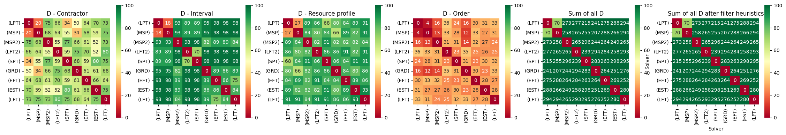
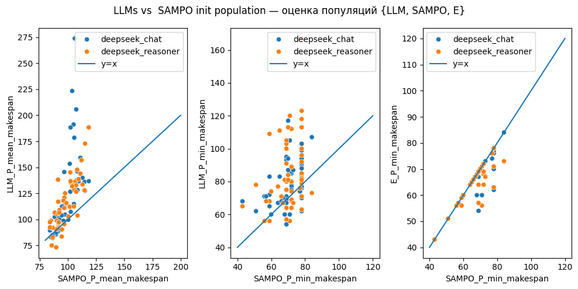

# Метод генерации эвристик для RCPSP с помощью больших языковых моделей

## Цель работы
Улучшение качества генетического алгоритма для решения задачи RCPSP, используя генерацию эвристик с помощью большой языковой модели, для повышения сходимости при решении задач RCPSP.

## Литературный обзор
### 1. Промптинг стратегии (ограниченные генерации)
    - LMEA (LLMs as Evolutionary Optimizers)
        Использует LLM как оптимизатор в генетическом алгоритме.
[Статья](https://arxiv.org/pdf/2310.19046), [Git](https://arxiv.org/abs/2310.19046)  

    - OPRO (Optimization by PROmpting)
        Разработка промптов от Google Deepmind. С использованием принципа обратной связи при генерации решений. 
[Статья](https://arxiv.org/pdf/2309.03409), [Git](https://github.com/google-deepmind/opro)  

    - SGE (Self-Guiding Exploration)
        Фреймворк решения задач в несколько стадий (от декомпозиции до решения задачи).
[Статья](https://arxiv.org/pdf/2405.17950), [Git](https://github.com/Zangir/LLM-for-CP)  

    - PHP (Progressive-hint prompting)
        Схож с OPRO, иттерационно рядом с заданием на генерацию указывает все предыдущие ответы.
[Статья](https://arxiv.org/pdf/2304.09797)


## Эксперимент 
### 0. Генерация датасета
В качестве датасета были взяты маленькие синтетические графы работ, сгенированные с помощью SAMPO. 
Характеристики проектов:  
    - Размер проектов ~30 задач (Jobs).  
    - Количество уникальных возообновляемых ресурсов - 6.  
    - Количество назначаемых исполнителей 5.

См. - путь `wgs/small_synth`

### 1. Генерация эвристик
Пайплайн генерации:  
`1 Exploration` (попросить модель перечислить названия эвристических методов, что решают MM-RCPSP)  
`2 Decomposition` (предоставить модели все шаги для реализации эвристики)  
`3 Integrate` (в виде сложного промпта и с объединением вводной информации из предыдущих шагов собрать инструкцию для кода)  
`4 Interpretate` (Запуск кода и проверка программных и из математической ПЗ ограничений)

C 1-3 этап есть соовествующие пропмпты в папке `prompts`.

Результат генерации в папке `Heuristics` (name_folder == Название модели)
- deepseek_chat
- deepseek_reasoner

### 2. Оценка качества генерации популяции из LLMs generated эвристик

Сгенерированные эвристики представляют собой решения из коробки, качество которых нужно интерпретировать для продолжения решения задачи. 

Есть 3 фактора тестов на сравнение эвристик:  
    - `Реализуемость`  
    - `Уникальность от других решений`  
    - `Оптимальность из постановки RCPSP`  

#### Реализуемость
Представимое решение из эвристик должно быть проверено на 1) факт соотвествия графу активностей (все предшественники должны быть выполнены до начала работы),
2) на фактическое Capacity для некоторого исполнителя (назначаемый ресурс не выходит за рамки, того, что есть у подрядчика).

#### Уникальность от других решений

В связи с этим были рассмотрены 5 метрик:

Обозначим множество всех решателей через $S$, а проект через $J$.
Каждому решателю $A \in S$ сопоставлено решение (расписание) по всем
ограничениям и переменным проекта $J$.

Для пары решений $A, B \in S$ введём метрику расстояния $d(A,B)$ как
сумму четырёх компонент:

$$
d(A,B)
=
d_{\text{contractor}}(A,B)
+
d_{\text{interval}}(A,B)
+
d_{\text{resource}}(A,B)
+
d_{\text{order}}(A,B).
$$

Поскольку все решатели рассматривают один и тот же проект $J$, 
множество работ (переменных/активностей) одинаково для всех решений.
Тогда для любой пары решателей $A,B \in S$:

$$
J_A = J_B = J,
\qquad
J_{AB} = J.
$$

1. Доля различий по подрядчикам

$$
d_{\text{contractor}}(A,B)
=
\frac{1}{\lvert J \rvert}
\sum_{j \in J}
\mathbf{1}\!\left[
c_{A,j} \neq c_{B,j}
\right].
$$

2. Доля различий по интервалам

$$
d_{\text{interval}}(A,B)
=
\frac{1}{\lvert J \rvert}
\sum_{j \in J}
\mathbf{1}\!\left[
\left(t^{\text{start}}_{A,j}, t^{\text{end}}_{A,j}\right)
\neq
\left(t^{\text{start}}_{B,j}, t^{\text{end}}_{B,j}\right)
\right].
$$

3. Доля различий по ресурсным профилям

$$
d_{\text{resource}}(A,B)
=
\frac{1}{\lvert J \rvert}
\sum_{j \in J}
\mathbf{1}\!\left[
\text{res\_profile}_A(j)
\neq
\text{res\_profile}_B(j)
\right].
$$

4. Доля различий по относительному порядку работ (на основе коэффицента Кендалла)

Сначала введём функцию знака:

$$
\operatorname{sgn}(x) =
\begin{cases}
-1, & x < 0,\\
0, & x = 0,\\
1, & x > 0.
\end{cases}
$$

Тогда

$$
d_{\text{order}}(A,B)
=
\frac{1}{\binom{\lvert J \rvert}{2}}
\sum_{\substack{i,j \in J \\ i < j}}
\mathbf{1}\!\left[
\operatorname{sgn}\!\bigl(t^{\text{start}}_{A,i} - t^{\text{start}}_{A,j}\bigr)
\neq
\operatorname{sgn}\!\bigl(t^{\text{start}}_{B,i} - t^{\text{start}}_{B,j}\bigr)
\right].
$$  




    На картинке представлены результат анализа метрик для эвристик из deepseek_chat, на примере решения 1 сэмпла из датасета.
    При анализе становится очевидным, что решатель сопоставленный по всем метриках на самого себя дает 0, что означает полное отсутствие предлогаемого разнообразия. Такой способ позволяет контролировать и более критичные кейсы, например, когда 2 разных кода (с точки зрения названия метода) возвращают одинаковые решения.

#### Оптимальность из постановки RCPSP

min makespan LLM population <= min makespan SAMPO.

В таблице показан пример на тестовом датасете - с какой частотностью LLM решения возвращают не хуже по минимальному makespan из генерации SAMPO.

    LLM_used  
    deepseek_chat        24.5 % 
    deepseek_reasoner    28.6 %

Нынешние виды тестов и предобработок показали результат ~ 100 % feasibility кода.



Пусть SAMPO имеет множество для начальной популяции SAMPO_P = { .... }, как и LLM heuristics, и E -- обозначим за объединенное множество E = SAMPO_P + LLM_P.

На графике выше представлены результаты оценок сравниваний min, mean статистик над этими множествами по makespan характеристике. 

Для иллюстрации была нанесена прямая y=x, чтобы показать ситуации когда LLM генерирует более оптимальные решения чем в SAMPO. 

### 3. Проверка исследовательской цели работы

 TODO:  
    - имплентировать Python-решения в Schedule объекты библиотеки SAMPO, а затем переопределить GA, где в качестве стартовой популяции будут использоваться эвристики LLM  
    - увеличить кол-во тестируемых моделей на предмет качества генерации  (разнообразнее LLM)  
    - сгенерировать датасеты с большим количеством задач и проверить сходимость  

## Рекомендации по установке

- Создание и активация среды  
  1) Создание
    ```python3 -m venv project_rcpsp```
  2) Активация
    ```source .project_rcpsp/bin/activate```

- Установка зависимостей для проекта (переустановка)
    ```pip install -r requirements.txt```